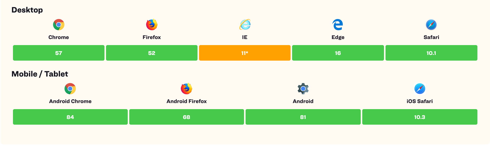

# CssgridPresentation

This project was generated with [Angular CLI](https://github.com/angular/angular-cli) version 10.0.4.

## Run this project locally and play around!

Clone this repo:

`git clone https://github.com/quincarter/css-grid-presentation.git`

Install the dependencies (assuming you have npm/node installed on your machine already)

`npm install`

## Development server

Run `npm run start` for a dev server. It should open your favorite browser and navigate to `http://localhost:4200/`, if not, type that in the address bar and go there yourself. The app will automatically reload if you change any of the source files.

# Project setup:

# Why CSS Grid?

CSS Grid Layout (aka “Grid”), is a two-dimensional grid-based layout system that aims to do nothing less than
    completely change the way we design grid-based user interfaces. CSS has always been used to lay out our web pages, but
    it’s never done a very good job of it. First, we used tables, then floats, positioning and inline-block, but all of
    these methods were essentially hacks and left out a lot of important functionality (vertical centering, for instance).
    Flexbox helped out, but it’s intended for simpler one-dimensional layouts, not complex two-dimensional ones (Flexbox
    and Grid actually work very well together). Grid is the very first CSS module created specifically to solve the layout
    problems we’ve all been hacking our way around for as long as we’ve been making websites.
    
    
## Browser Support

